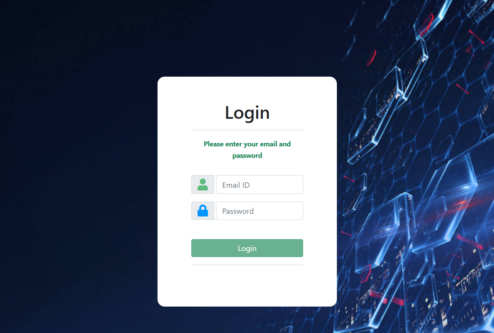
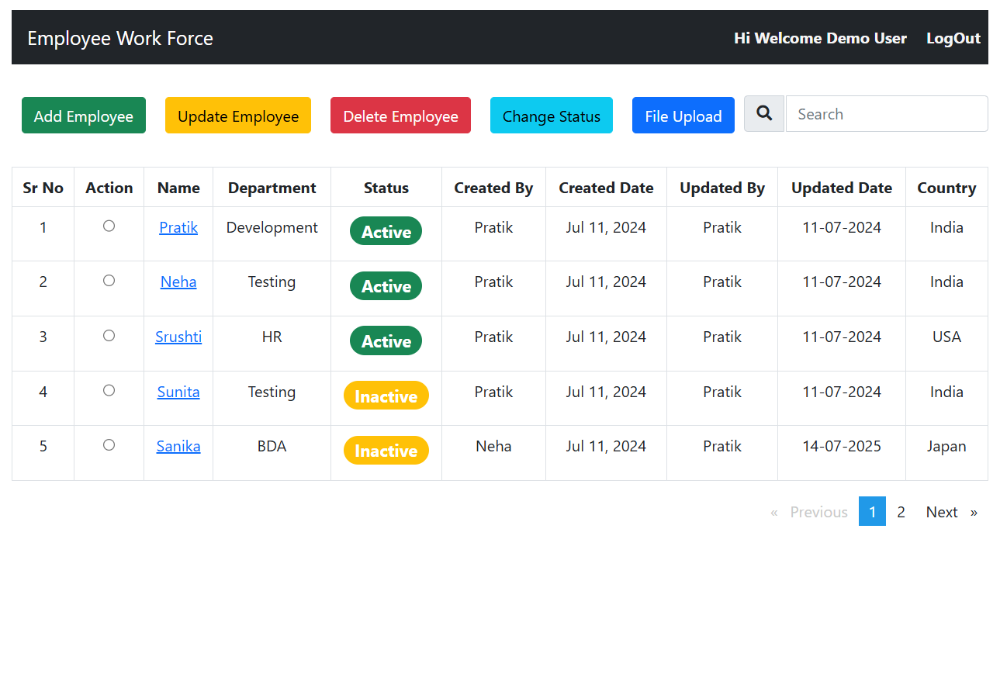
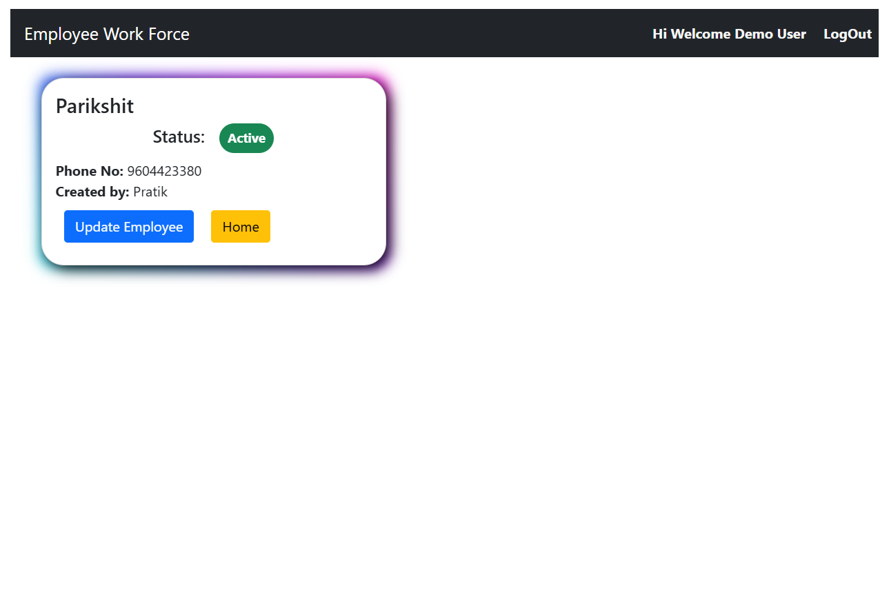
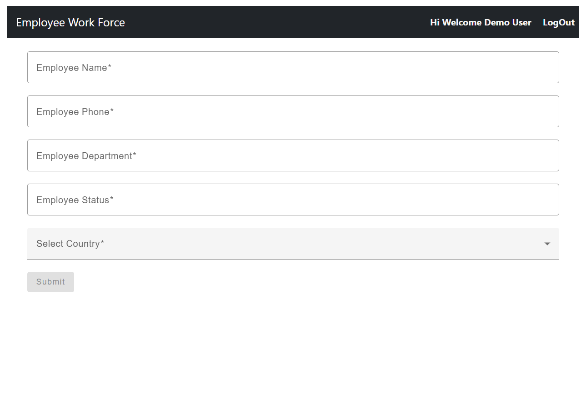
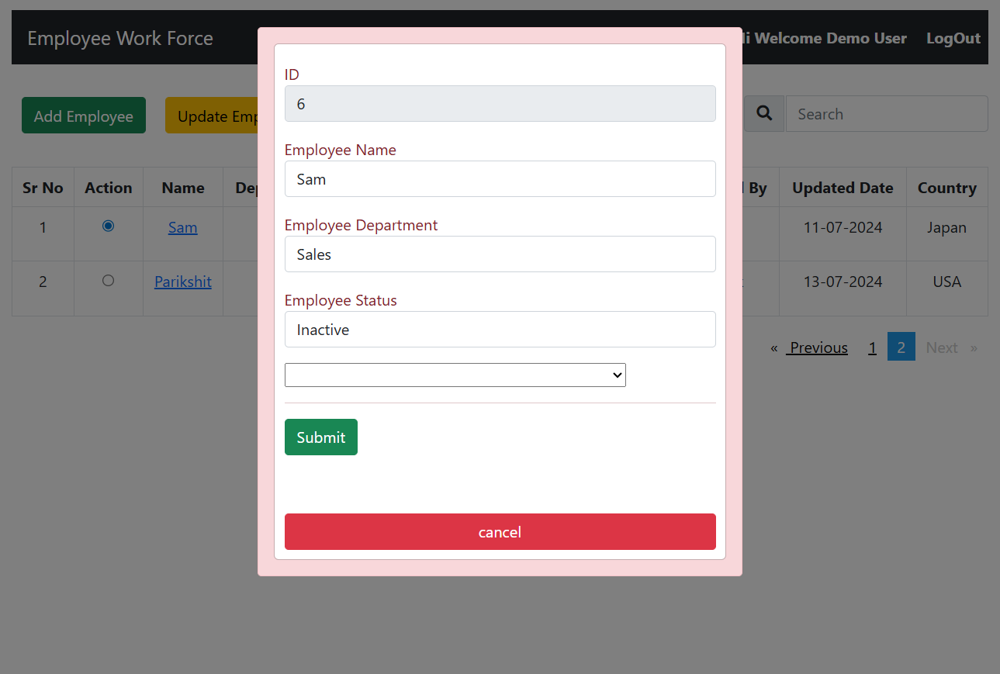
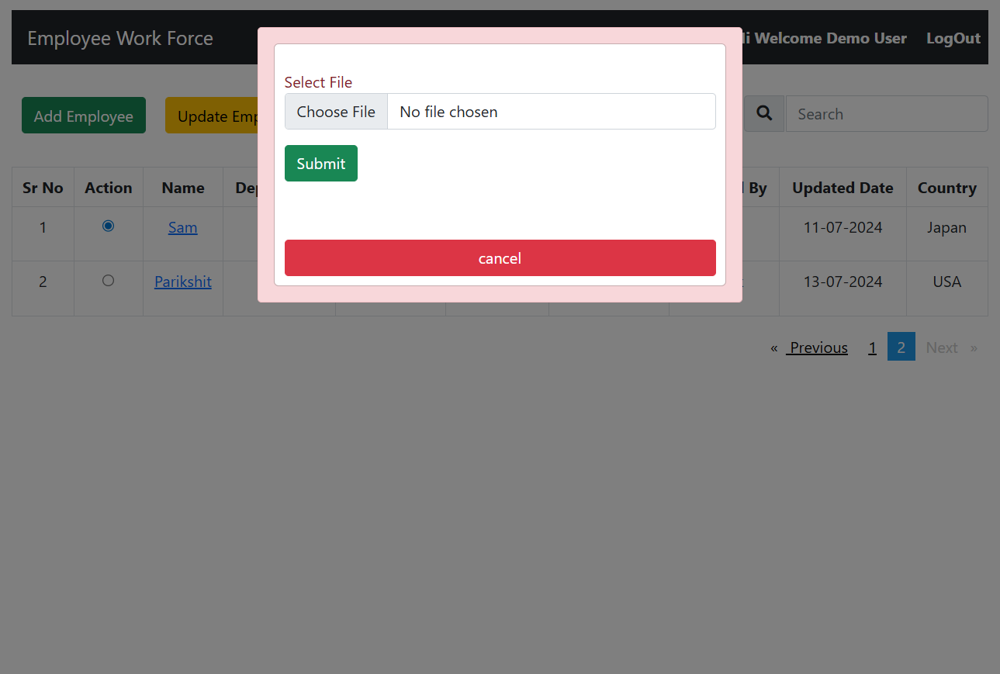

# Employee Management Portal

A full-stack employee management system that allows user login, monitor and manage employee work force in the company.
---

## ✅ Features

- 🧾 Employee registration and update
- 👨‍💼 Add, remove and manage employee information and working status
- 🔍 Search filter
- 📤 File/image upload
- 🔐 Secure login using Registration credentials
- 🌐 REST API with JSON response

---

## 🛠️ Technologies Used

### Backend
- Java 17
- Spring Boot 3.2.7
- Spring MVC, Spring Data JPA
- Hibernate
- MySQL
- Maven

### Frontend
- Angular 16
- RxJS
- Angular Material
- Bootstrap 5
- ngx-toastr, ngx-pagination

### Tools & Libraries
- STS (Spring Tool Suite)
- Visual Studio Code
- Postman
- Git & GitHub

---

## 📁 Overall Project Structure

```
employee-management-portal/
├── backend/
│   ├── src/
│   │   ├── main/java/com/pm/EmployeeManagementPortal/
│   │   └── resources/
│   │       ├── application.properties
│   │       ├── schema.sql
│   │       └── data.sql
│   └── pom.xml
├── frontend/
│   ├── src/
│   ├── angular.json
│   └── package.json
├── .gitignore
├── README.md
└── LICENSE
```

---

## 🚀 Getting Started

### ✅ Prerequisites
- Java 17+
- Node.js 18+
- MySQL
- Angular CLI


### ▶️ Backend Setup
```bash
# Open in STS and run the app
cd backend
# Open 'application.properties'
# Set your MySQL DB config
mvn spring-boot:run
```

⚙️ On first run, the app will:

- Create the database schema
- Insert a demo user
- Populate the country table

---

## 📦 Auto Database Initialization

On first startup, `schema.sql` and `data.sql` automatically:

- Create tables (`registration`, `employee`, `country`)
- Insert a demo registration user
- Insert all countries of the world

---

### ▶️ Frontend Setup
```bash
cd frontend
npm install
ng serve
```

Visit: `http://localhost:4200`

---

## 👤 Demo Login

- **Email**: `demo@example.com`  
- **Password**: `demo123`

---

## 📦 Required Frontend Libraries
```bash
npm install bootstrap
npm install @angular/material
npm install ngx-toastr
npm install ngx-pagination
npm install @fortawesome/fontawesome-free
```

---

## 📸 Screenshots








---

## 📃 License

This project is open-source under the [MIT License](LICENSE)
